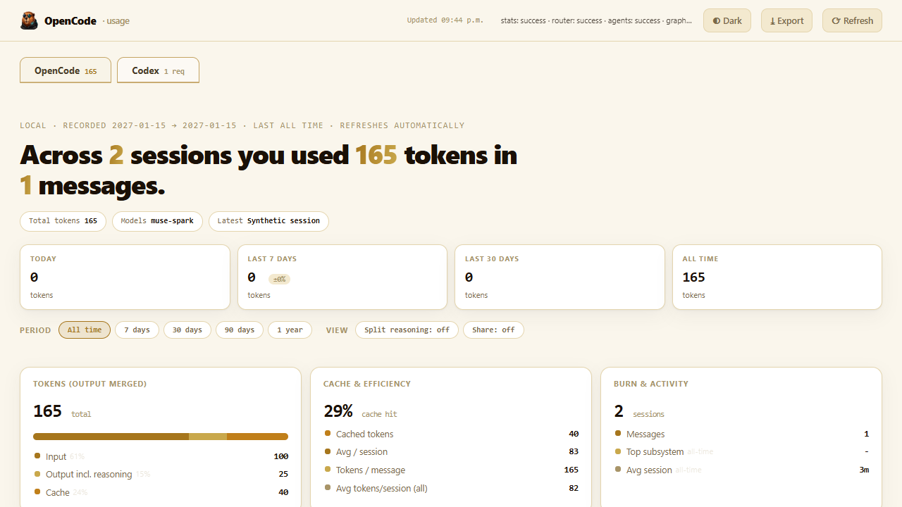

# Little Better Dashboard

A single-file, zero-dependency usage dashboard for [OpenCode](https://github.com/sst/opencode) with a Codex view built in. Download it, double-click the launcher, and your own stats appear in the browser.




## What it shows

**OpenCode tab** covers sessions, turns, tokens and cost, with tokens per day, tokens by model, an activity heatmap and streaks, a session browser that includes search and a click-to-open message inspector, plus projects, warning signals, child and related sessions with **session activity** (recent, no recent activity, older or unknown — based on session updates, not execution status; auto-refreshed), agent configuration tiles, and a team graph of parent and child sessions.

**Codex tab** gives the same treatment to your local Codex sessions, with request, token and model stats synthesized from your rollout files alongside a browsable session table.

Everything is read from files already on your machine. The server binds to `127.0.0.1` only and additionally requires a per-instance bearer token plus strict Host/Origin checks; the bind alone is not claimed to prevent all exfiltration.

Privacy: The dashboard may read and display message content from your local OpenCode and Codex sessions for session inspection. This content stays on your machine and is only served to a browser session presenting the instance token over the local 127.0.0.1 dashboard. Nothing is uploaded or sent to external services. Private content is visible to anyone holding the instance link, and tunnels or public exposure are not supported.

## Quick start (one click)

Requirements: **Python 3** (3.10 or newer works, and it is tested on 3.14) and OpenCode run at least once, so that its database exists.

- **Windows:** double-click `start-dashboard.bat`
- **macOS / Linux:** run `./start-dashboard.sh` (or `bash start-dashboard.sh`)

The dashboard opens in your browser at `http://127.0.0.1:8765/#token=…` (per-instance token in the URL fragment; the fragment is never sent over HTTP and no `?token=` query string is used).

Prefer the terminal?

```bash
python opencode_dashboard.py --open
```

## Options

```
python opencode_dashboard.py [db] [--port PORT] [--agents-dir DIR] [--open] [--quiet]
```

| Argument | Default | What it does |
|---|---|---|
| `db` | `~/.local/share/opencode/opencode.db` | Path to the OpenCode database |
| `--port` | `8765` | HTTP port to serve on |
| `--agents-dir DIR` | auto-detected | Extra dir with agent `.md` files (repeatable) |
| `--open` | off | Open the dashboard in a browser on start |
| `--quiet` | off | Suppress per-request logging |
| `--router-events / --router-limits` | unset | Use a real Codex Router ledger instead of the synthesized one |
| `--idle-timeout SECONDS` | off | Shut down after N seconds with no requests |

If the database is missing, you get a plain message asking you to run OpenCode at least once so it can be created.

## Where the data comes from

| Source | Used for |
|---|---|
| OpenCode `opencode.db` (SQLite, read-only) | Everything on the OpenCode tab |
| `~/.codex/sessions/**/*.jsonl` (local rollout files) | Codex tab. On the first run a small `codex_router_events.jsonl` index is built next to the script. It regenerates automatically and is safe to delete |
| `.opencode/agent/*.md` and `~/.config/opencode/agent/*.md` in the current project | Agent configuration tiles |

It makes no network calls, collects no telemetry and needs no accounts.

## Notes

- The first start can take up to a minute on large databases while SQLite warms up.
- Agent tiles group workers under their leads by filename convention (`tl-1`, `tl-1-w1`, and so on).
- Child-session activity comes from session update recency (recent up to 2 minutes, no recent activity up to 15 minutes, older beyond; unknown when the timestamp is missing or uninterpretable). It is not agent execution status, and a parent_id link is a session relation, not proof of delegation.

## Project layout

```
little-better-dashboard/
├── opencode_dashboard.py   # the whole app: backend, API and UI
├── logo.png                # mascot
├── start-dashboard.bat     # one-click start (Windows)
├── start-dashboard.sh      # one-click start (macOS/Linux)
├── LICENSE                 # MIT
└── README.md
```

## License

MIT, see [LICENSE](LICENSE).
